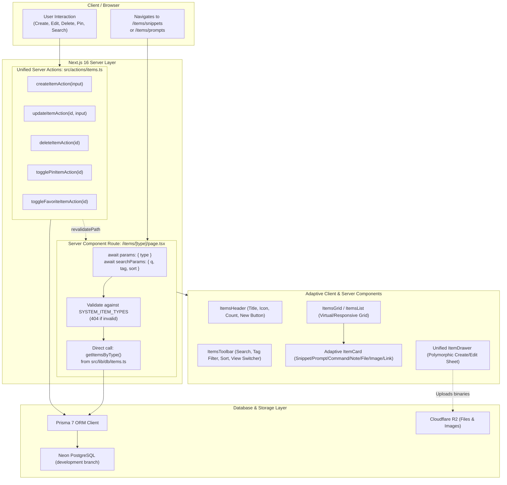
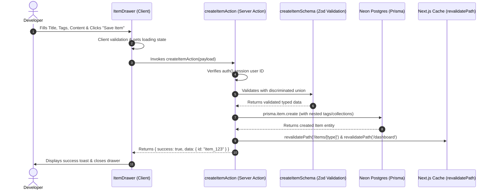

# Unified Item CRUD Architecture Specification

> **DevStash Technical Architecture Document**  
> Unified design for Server Actions, data access queries, dynamic routing, polymorphic UI components, and type-adaptive workflows across all 7 DevStash item types.

---

## 📑 Table of Contents

- [1. Executive Summary & Design Principles](#1-executive-summary--design-principles)
- [2. System Architecture & Component Hierarchy](#2-system-architecture--component-hierarchy)
- [3. Complete File & Directory Structure](#3-complete-file--directory-structure)
- [4. Dynamic Route Architecture: `/items/[type]`](#4-dynamic-route-architecture-itemstype)
  - [4.1 Next.js 16 Async Route Parameters](#41-nextjs-16-async-route-parameters)
  - [4.2 Type Validation & 404 Routing](#42-type-validation--404-routing)
  - [4.3 Query Parameter & Filter Handling](#43-query-parameter--filter-handling)
  - [4.4 Dynamic Metadata Generation](#44-dynamic-metadata-generation)
- [5. Data Access Layer (`src/lib/db/items.ts`)](#5-data-access-layer-srclibdbitemsts)
  - [5.1 Query Signatures & Contracts](#51-query-signatures--contracts)
  - [5.2 React `cache()` & Performance Indexing](#52-react-cache--performance-indexing)
- [6. Unified Server Actions (`src/actions/items.ts`)](#6-unified-server-actions-srcactionsitemsts)
  - [6.1 Unified Action Philosophy](#61-unified-action-philosophy)
  - [6.2 Action Signatures & Error Protocol](#62-action-signatures--error-protocol)
  - [6.3 Zod Validation & Discriminated Union Schemas](#63-zod-validation--discriminated-union-schemas)
- [7. Separation of Concerns: Where Type-Specific Logic Lives](#7-separation-of-concerns-where-type-specific-logic-lives)
- [8. Adaptive Component Architecture](#8-adaptive-component-architecture)
  - [8.1 Component Responsibility Matrix](#81-component-responsibility-matrix)
  - [8.2 Polymorphic Field Editor Pattern](#82-polymorphic-field-editor-pattern)
  - [8.3 Polymorphic Card & Detail Viewer Pattern](#83-polymorphic-card--detail-viewer-pattern)
- [9. End-to-End Mutation & Data Flow](#9-end-to-end-mutation--data-flow)
- [10. Implementation Plan & Actionable Checklist](#10-implementation-plan--actionable-checklist)

---

## 1. Executive Summary & Design Principles

DevStash manages **7 distinct item types** (`snippet`, `prompt`, `command`, `note`, `file`, `image`, `link`) spanning 3 content classifications (`TEXT`, `FILE`, `URL`). Building separate routes, actions, and schemas for each type would lead to severe code fragmentation, duplication, and maintenance overhead.

This architecture enforces **3 Core Principles**:

1. **Unified Mutations in a Single Action File**: All database writes (create, update, delete, favorite, pin, collection assignment) are routed through [`src/actions/items.ts`](file:///c:/Rajesh%20Files/Personal%20Project/devstash/src/actions/items.ts) with standardized Zod input validation and `{ success, data, error }` response wrappers.
2. **Direct Server Component Queries in `lib/db/`**: Data fetching is co-located in [`src/lib/db/items.ts`](file:///c:/Rajesh%20Files/Personal%20Project/devstash/src/lib/db/items.ts) using Prisma, invoked directly within React Server Components (RSC) without client-side waterfalls or redundant API routes.
3. **Single Dynamic Route with Adaptive Polymorphic UI**: A single route (`/items/[type]`) handles all 7 types. The route layer remains generic, while type-specific UI behaviors (e.g., syntax highlighters, markdown renderers, terminal copy boxes, R2 file dropzones, URL previews) live strictly inside **pluggable UI components**.

---

## 2. System Architecture & Component Hierarchy



---

## 3. Complete File & Directory Structure

To adhere to the project conventions established in [`context/coding-standards.md`](file:///c:/Rajesh%20Files/Personal%20Project/devstash/context/coding-standards.md), the Item CRUD architecture is organized into dedicated directories:

```
devstash/
├── src/
│   ├── actions/
│   │   └── items.ts                     # Unified Server Actions (create, update, delete, toggle)
│   ├── app/
│   │   └── (dashboard)/                 # Dashboard route group sharing layout
│   │       ├── dashboard/
│   │       │   └── page.tsx             # Main dashboard overview
│   │       └── items/
│   │           ├── page.tsx             # All items aggregate view (/items)
│   │           └── [type]/
│   │               ├── page.tsx         # Polymorphic items page (/items/[type])
│   │               ├── loading.tsx      # Type-specific skeleton loaders
│   │               └── not-found.tsx    # 404 handler for invalid item types
│   ├── components/
│   │   └── items/
│   │       ├── items-header.tsx         # Header with type icon, title, counter & CTAs
│   │       ├── items-toolbar.tsx        # Search, filters, sort dropdown, view mode toggle
│   │       ├── items-grid.tsx           # Responsive container for item cards/rows
│   │       ├── item-card.tsx            # Unified adaptive card with polymorphic presentation
│   │       ├── item-drawer.tsx          # Create/Edit slide-over modal sheet
│   │       ├── item-view-modal.tsx      # Full-detail viewer (code, markdown, terminal, media)
│   │       ├── delete-item-dialog.tsx   # Accessible delete confirmation dialog
│   │       ├── tag-filter-bar.tsx       # Horizontal scrolling tag filter chips
│   │       └── type-editors/            # Pluggable sub-forms for polymorphic field editing
│   │           ├── code-field-editor.tsx       # Monaco / Code textarea with syntax selection
│   │           ├── prompt-field-editor.tsx     # Markdown editor with variable tag tokens
│   │           ├── command-field-editor.tsx    # Monospace terminal input with shell selector
│   │           ├── note-field-editor.tsx       # Rich Markdown editor
│   │           ├── file-field-editor.tsx       # Cloudflare R2 file uploader dropzone
│   │           ├── image-field-editor.tsx      # Image uploader with thumbnail preview
│   │           └── link-field-editor.tsx       # URL input with domain metadata extractor
│   ├── lib/
│   │   ├── constants/
│   │   │   └── item-types.ts            # Single source of truth for 7 system types
│   │   └── db/
│   │       └── items.ts                 # Direct Prisma data fetching for RSC
│   └── types/
│       └── items.ts                     # Zod schemas, TypeScript types & discriminated unions
```

---

## 4. Dynamic Route Architecture: `/items/[type]`

### 4.1 Next.js 16 Async Route Parameters

In Next.js 16 (App Router), `params` and `searchParams` are asynchronous Promises that must be awaited before accessing properties:

```typescript
// src/app/items/[type]/page.tsx

import { notFound, redirect } from "next/navigation";
import { auth } from "@/auth";
import { getItemsByType, getItemTypeCounts } from "@/lib/db/items";
import { SYSTEM_ITEM_TYPES, type SystemItemTypeName } from "@/lib/constants/item-types";
import { ItemsHeader } from "@/components/items/items-header";
import { ItemsToolbar } from "@/components/items/items-toolbar";
import { ItemsGrid } from "@/components/items/items-grid";

export const dynamic = "force-dynamic";

interface ItemTypePageProps {
  params: Promise<{ type: string }>;
  searchParams: Promise<{
    q?: string;
    tag?: string;
    sort?: "newest" | "oldest" | "title" | "updated";
    favorite?: string;
    pinned?: string;
    page?: string;
    limit?: string;
  }>;
}

export default async function ItemTypePage({
  params,
  searchParams,
}: ItemTypePageProps) {
  // 1. Await Next.js 16 async params & searchParams
  const { type } = await params;
  const resolvedSearchParams = await searchParams;

  // 2. Validate route param against system types
  const normalizedType = type.toLowerCase() as SystemItemTypeName;
  const typeConfig = SYSTEM_ITEM_TYPES[normalizedType];

  if (!typeConfig) {
    notFound();
  }

  // 3. Authenticate session
  const session = await auth();
  if (!session?.user?.id) {
    redirect(`/sign-in?callbackUrl=/items/${normalizedType}`);
  }

  // 4. Fetch data in parallel directly from database layer
  const [itemsData, counts] = await Promise.all([
    getItemsByType({
      userId: session.user.id,
      typeName: normalizedType,
      search: resolvedSearchParams.q,
      tag: resolvedSearchParams.tag,
      sort: resolvedSearchParams.sort || "newest",
      onlyFavorites: resolvedSearchParams.favorite === "true",
      onlyPinned: resolvedSearchParams.pinned === "true",
      page: Number(resolvedSearchParams.page) || 1,
      limit: Number(resolvedSearchParams.limit) || 24,
    }),
    getItemTypeCounts(session.user.id),
  ]);

  return (
    <div className="space-y-6 max-w-7xl mx-auto pb-12">
      <ItemsHeader
        typeConfig={typeConfig}
        totalCount={itemsData.total}
      />
      <ItemsToolbar
        typeName={normalizedType}
        activeTag={resolvedSearchParams.tag}
        availableTags={itemsData.availableTags}
        currentSort={resolvedSearchParams.sort || "newest"}
      />
      <ItemsGrid
        items={itemsData.items}
        typeConfig={typeConfig}
      />
    </div>
  );
}
```

### 4.2 Type Validation & 404 Routing

To prevent unauthorized, invalid, or injection-prone URL paths:

1. Look up `params.type` in `SYSTEM_ITEM_TYPES` (or query user-defined custom types in future phases).
2. If no matching type definition is found, invoke Next.js `notFound()`, which renders [`src/app/items/[type]/not-found.tsx`](file:///c:/Rajesh%20Files/Personal%20Project/devstash/src/app/items/%5Btype%5D/not-found.tsx).
3. Provide static param optimization via `generateStaticParams()`:

```typescript
export function generateStaticParams() {
  return [
    { type: "snippets" },
    { type: "prompts" },
    { type: "commands" },
    { type: "notes" },
    { type: "files" },
    { type: "images" },
    { type: "links" },
  ];
}
```

### 4.3 Query Parameter & Filter Handling

The URL search parameters define the active filter state, making all searches, tag filters, sorting modes, and pagination shareable and bookmarkable:

| Search Parameter | Type      | Default     | Description                                           | Example           |
| :--------------- | :-------- | :---------- | :---------------------------------------------------- | :---------------- |
| `q`              | `string`  | `""`        | Search keyword for title, content, description        | `?q=auth+hook`    |
| `tag`            | `string`  | `undefined` | Filter items by single tag name                       | `?tag=typescript` |
| `sort`           | `enum`    | `"newest"`  | Sorting order: `newest`, `oldest`, `title`, `updated` | `?sort=updated`   |
| `favorite`       | `boolean` | `false`     | Show only favorited items                             | `?favorite=true`  |
| `pinned`         | `boolean` | `false`     | Show only pinned items                                | `?pinned=true`    |
| `page`           | `number`  | `1`         | Pagination page offset                                | `?page=2`         |

### 4.4 Dynamic Metadata Generation

```typescript
// src/app/items/[type]/page.tsx

import type { Metadata } from "next";

export async function generateMetadata({
  params,
}: {
  params: Promise<{ type: string }>;
}): Promise<Metadata> {
  const { type } = await params;
  const normalizedType = type.toLowerCase() as SystemItemTypeName;
  const config = SYSTEM_ITEM_TYPES[normalizedType];

  if (!config) {
    return { title: "Item Type Not Found | DevStash" };
  }

  return {
    title: `${config.pluralLabel} | DevStash`,
    description: config.description,
  };
}
```

---

## 5. Data Access Layer (`src/lib/db/items.ts`)

### 5.1 Query Signatures & Contracts

The database layer handles all Prisma reads with structured query builders:

```typescript
// src/lib/db/items.ts

import { cache } from "react";
import { prisma } from "@/lib/prisma";
import type { SystemItemTypeName } from "@/lib/constants/item-types";
import type { Prisma } from "@/generated/prisma/client";

export interface GetItemsByTypeParams {
  userId: string;
  typeName: SystemItemTypeName;
  search?: string;
  tag?: string;
  collectionId?: string;
  sort?: "newest" | "oldest" | "title" | "updated";
  onlyFavorites?: boolean;
  onlyPinned?: boolean;
  page?: number;
  limit?: number;
}

export interface PaginatedItemsResult<T> {
  items: T[];
  total: number;
  page: number;
  limit: number;
  totalPages: number;
  availableTags: string[];
}

/**
 * Fetches items for a specific item type with full-text search, tag filters, sorting, and pagination.
 * Wrapped in React cache() for request deduplication.
 */
export const getItemsByType = cache(
  async ({
    userId,
    typeName,
    search,
    tag,
    collectionId,
    sort = "newest",
    onlyFavorites = false,
    onlyPinned = false,
    page = 1,
    limit = 24,
  }: GetItemsByTypeParams) => {
    // 1. Build where filter conditions
    const where: Prisma.ItemWhereInput = {
      userId,
      itemType: {
        name: typeName,
      },
      ...(onlyFavorites && { isFavorite: true }),
      ...(onlyPinned && { isPinned: true }),
      ...(tag && {
        tags: {
          some: { name: { equals: tag, mode: "insensitive" } },
        },
      }),
      ...(collectionId && {
        collections: {
          some: { collectionId },
        },
      }),
      ...(search && {
        OR: [
          { title: { contains: search, mode: "insensitive" } },
          { description: { contains: search, mode: "insensitive" } },
          { content: { contains: search, mode: "insensitive" } },
          { language: { contains: search, mode: "insensitive" } },
          { fileName: { contains: search, mode: "insensitive" } },
          { url: { contains: search, mode: "insensitive" } },
        ],
      }),
    };

    // 2. Build sort order
    const orderBy: Prisma.ItemOrderByWithRelationInput[] = [];
    if (onlyPinned) {
      orderBy.push({ createdAt: "desc" });
    } else {
      orderBy.push({ isPinned: "desc" }); // Pinned items always float to top by default
      switch (sort) {
        case "oldest":
          orderBy.push({ createdAt: "asc" });
          break;
        case "title":
          orderBy.push({ title: "asc" });
          break;
        case "updated":
          orderBy.push({ updatedAt: "desc" });
          break;
        case "newest":
        default:
          orderBy.push({ createdAt: "desc" });
          break;
      }
    }

    const skip = (Math.max(page, 1) - 1) * limit;

    // 3. Execute count and findMany in parallel
    const [total, items, userTags] = await Promise.all([
      prisma.item.count({ where }),
      prisma.item.findMany({
        where,
        orderBy,
        skip,
        take: limit,
        include: {
          itemType: {
            select: { id: true, name: true, icon: true, color: true },
          },
          tags: {
            select: { name: true },
          },
          collections: {
            select: { collection: { select: { id: true, name: true } } },
          },
        },
      }),
      prisma.tag.findMany({
        where: {
          items: {
            some: {
              userId,
              itemType: { name: typeName },
            },
          },
        },
        select: { name: true },
        take: 50,
      }),
    ]);

    return {
      items: items.map((item) => ({
        ...item,
        tags: item.tags.map((t) => t.name),
        collections: item.collections.map((c) => c.collection),
      })),
      total,
      page,
      limit,
      totalPages: Math.ceil(total / limit),
      availableTags: userTags.map((t) => t.name),
    };
  },
);

/**
 * Fetches a single item by ID with full relations, ensuring user ownership.
 */
export const getItemById = cache(async (id: string, userId: string) => {
  const item = await prisma.item.findFirst({
    where: {
      id,
      userId,
    },
    include: {
      itemType: {
        select: { id: true, name: true, icon: true, color: true },
      },
      tags: {
        select: { name: true },
      },
      collections: {
        select: { collection: { select: { id: true, name: true } } },
      },
    },
  });

  if (!item) return null;

  return {
    ...item,
    tags: item.tags.map((t) => t.name),
    collections: item.collections.map((c) => c.collection),
  };
});
```

### 5.2 React `cache()` & Performance Indexing

All query functions in [`src/lib/db/items.ts`](file:///c:/Rajesh%20Files/Personal%20Project/devstash/src/lib/db/items.ts) leverage React's built-in `cache()` function to memoize and deduplicate calls within a single request lifecycle (e.g. `layout.tsx` and `page.tsx` querying common item counters).

Furthermore, queries exploit composite PostgreSQL indexes already defined in [`prisma/schema.prisma`](file:///c:/Rajesh%20Files/Personal%20Project/devstash/prisma/schema.prisma):

- `@@index([userId, isPinned, createdAt(sort: Desc)])`
- `@@index([userId, isFavorite])`
- `@@index([userId])`
- `@@index([itemTypeId])`

---

## 6. Unified Server Actions (`src/actions/items.ts`)

### 6.1 Unified Action Philosophy

Instead of creating separate action files like `createSnippet`, `createPrompt`, `createFile`, etc., all item mutations are managed in a single module: [`src/actions/items.ts`](file:///c:/Rajesh%20Files/Personal%20Project/devstash/src/actions/items.ts).

**Advantages**:

- **Single Point of Security Enforcement**: Auth sessions, user permissions, and rate limits are audited in one centralized location.
- **Consistent Revalidation Logic**: Automatic cache invalidation across `/dashboard`, `/items`, `/items/[type]`, and `/collections` via `revalidatePath()`.
- **Maintainable Transaction Boundary**: Many-to-many tagupserts (`connectOrCreate`) and collection associations (`ItemCollection`) are structured identically across all types.

### 6.2 Action Signatures & Error Protocol

All Server Actions follow the standard `{ success: boolean; data?: T; error?: string }` response envelope:

```typescript
// src/types/items.ts

export interface ActionResponse<T = unknown> {
  success: boolean;
  data?: T;
  error?: string;
  fieldErrors?: Record<string, string[]>;
}
```

```typescript
// src/actions/items.ts
"use server";

import { revalidatePath } from "next/cache";
import { auth } from "@/auth";
import { prisma } from "@/lib/prisma";
import {
  createItemSchema,
  updateItemSchema,
  type CreateItemInput,
  type UpdateItemInput,
} from "@/types/items";

/**
 * Creates a new item of any type with automatic tagupsert and collection assignment.
 */
export async function createItemAction(
  rawInput: CreateItemInput,
): Promise<{ success: boolean; data?: { id: string }; error?: string }> {
  try {
    const session = await auth();
    if (!session?.user?.id) {
      return { success: false, error: "Unauthorized. Please sign in." };
    }

    const userId = session.user.id;
    const validated = createItemSchema.safeParse(rawInput);

    if (!validated.success) {
      const firstError = Object.values(
        validated.error.flatten().fieldErrors,
      )[0]?.[0];
      return {
        success: false,
        error: firstError || "Invalid item input data.",
      };
    }

    const {
      title,
      itemTypeId,
      contentType,
      content,
      description,
      language,
      url,
      fileUrl,
      fileName,
      fileSize,
      isFavorite,
      isPinned,
      tags = [],
      collectionIds = [],
    } = validated.data;

    // Verify itemType exists
    const itemType = await prisma.itemType.findFirst({
      where: {
        id: itemTypeId,
        OR: [{ isSystem: true }, { userId }],
      },
    });

    if (!itemType) {
      return { success: false, error: "Invalid item type specified." };
    }

    // Create item with nested tags and collection relations
    const item = await prisma.item.create({
      data: {
        title,
        contentType,
        content: contentType === "TEXT" ? content : null,
        url: contentType === "URL" ? url : null,
        fileUrl: contentType === "FILE" ? fileUrl : null,
        fileName: contentType === "FILE" ? fileName : null,
        fileSize: contentType === "FILE" ? fileSize : null,
        language: contentType === "TEXT" ? language : null,
        description,
        isFavorite: isFavorite ?? false,
        isPinned: isPinned ?? false,
        userId,
        itemTypeId: itemType.id,
        ...(tags.length > 0 && {
          tags: {
            connectOrCreate: tags.map((tagName) => ({
              where: { name: tagName.trim().toLowerCase() },
              create: { name: tagName.trim().toLowerCase() },
            })),
          },
        }),
        ...(collectionIds.length > 0 && {
          collections: {
            create: collectionIds.map((colId) => ({
              collectionId: colId,
            })),
          },
        }),
      },
    });

    // Revalidate paths
    revalidatePath("/dashboard");
    revalidatePath("/items");
    revalidatePath(`/items/${itemType.name.toLowerCase()}`);

    return { success: true, data: { id: item.id } };
  } catch (err) {
    console.error("Error creating item:", err);
    return {
      success: false,
      error: "An unexpected error occurred while creating item.",
    };
  }
}

/**
 * Updates an existing item and reconciles tags/collections.
 */
export async function updateItemAction(
  id: string,
  rawInput: UpdateItemInput,
): Promise<{ success: boolean; error?: string }> {
  try {
    const session = await auth();
    if (!session?.user?.id) {
      return { success: false, error: "Unauthorized." };
    }

    const userId = session.user.id;
    const validated = updateItemSchema.safeParse(rawInput);

    if (!validated.success) {
      return { success: false, error: "Invalid update data." };
    }

    // Verify ownership
    const existing = await prisma.item.findFirst({
      where: { id, userId },
      include: { itemType: true },
    });

    if (!existing) {
      return { success: false, error: "Item not found or access denied." };
    }

    const { tags, collectionIds, ...fields } = validated.data;

    await prisma.$transaction(async (tx) => {
      // 1. Update basic fields
      await tx.item.update({
        where: { id },
        data: {
          ...fields,
          ...(tags !== undefined && {
            tags: {
              set: [], // Clear old tags
              connectOrCreate: tags.map((t) => ({
                where: { name: t.trim().toLowerCase() },
                create: { name: t.trim().toLowerCase() },
              })),
            },
          }),
        },
      });

      // 2. Reconcile collection assignments if provided
      if (collectionIds !== undefined) {
        await tx.itemCollection.deleteMany({ where: { itemId: id } });
        if (collectionIds.length > 0) {
          await tx.itemCollection.createMany({
            data: collectionIds.map((collectionId) => ({
              itemId: id,
              collectionId,
            })),
          });
        }
      }
    });

    revalidatePath("/dashboard");
    revalidatePath("/items");
    revalidatePath(`/items/${existing.itemType.name.toLowerCase()}`);

    return { success: true };
  } catch (err) {
    console.error("Error updating item:", err);
    return { success: false, error: "Failed to update item." };
  }
}

/**
 * Deletes an item by ID.
 */
export async function deleteItemAction(
  id: string,
): Promise<{ success: boolean; error?: string }> {
  try {
    const session = await auth();
    if (!session?.user?.id) {
      return { success: false, error: "Unauthorized." };
    }

    const existing = await prisma.item.findFirst({
      where: { id, userId: session.user.id },
      include: { itemType: true },
    });

    if (!existing) {
      return { success: false, error: "Item not found." };
    }

    await prisma.item.delete({ where: { id } });

    revalidatePath("/dashboard");
    revalidatePath("/items");
    revalidatePath(`/items/${existing.itemType.name.toLowerCase()}`);

    return { success: true };
  } catch (err) {
    console.error("Error deleting item:", err);
    return { success: false, error: "Failed to delete item." };
  }
}

/**
 * Toggles the pinned status of an item.
 */
export async function togglePinItemAction(
  id: string,
): Promise<{ success: boolean; isPinned?: boolean; error?: string }> {
  try {
    const session = await auth();
    if (!session?.user?.id) return { success: false, error: "Unauthorized." };

    const item = await prisma.item.findFirst({
      where: { id, userId: session.user.id },
      include: { itemType: true },
    });

    if (!item) return { success: false, error: "Item not found." };

    const updated = await prisma.item.update({
      where: { id },
      data: { isPinned: !item.isPinned },
    });

    revalidatePath("/dashboard");
    revalidatePath(`/items/${item.itemType.name.toLowerCase()}`);

    return { success: true, isPinned: updated.isPinned };
  } catch {
    return { success: false, error: "Failed to toggle pin." };
  }
}

/**
 * Toggles the favorite status of an item.
 */
export async function toggleFavoriteItemAction(
  id: string,
): Promise<{ success: boolean; isFavorite?: boolean; error?: string }> {
  try {
    const session = await auth();
    if (!session?.user?.id) return { success: false, error: "Unauthorized." };

    const item = await prisma.item.findFirst({
      where: { id, userId: session.user.id },
      include: { itemType: true },
    });

    if (!item) return { success: false, error: "Item not found." };

    const updated = await prisma.item.update({
      where: { id },
      data: { isFavorite: !item.isFavorite },
    });

    revalidatePath("/dashboard");
    revalidatePath(`/items/${item.itemType.name.toLowerCase()}`);

    return { success: true, isFavorite: updated.isFavorite };
  } catch {
    return { success: false, error: "Failed to toggle favorite." };
  }
}
```

### 6.3 Zod Validation & Discriminated Union Schemas

```typescript
// src/types/items.ts

import { z } from "zod";
import { ContentType } from "@/generated/prisma/enums";

// Base Item Fields
const baseItemSchema = z.object({
  title: z
    .string()
    .trim()
    .min(1, "Title is required")
    .max(120, "Title is too long"),
  description: z
    .string()
    .trim()
    .max(500, "Description too long")
    .optional()
    .nullable(),
  itemTypeId: z.string().min(1, "Item type is required"),
  isFavorite: z.boolean().default(false),
  isPinned: z.boolean().default(false),
  tags: z
    .array(z.string().trim().min(1).max(30))
    .max(10)
    .optional()
    .default([]),
  collectionIds: z.array(z.string()).optional().default([]),
});

// Text Payload Schema (Snippet, Prompt, Command, Note)
const textItemPayloadSchema = baseItemSchema.extend({
  contentType: z.literal(ContentType.TEXT),
  content: z.string().min(1, "Content cannot be empty"),
  language: z.string().trim().max(50).optional().nullable(),
  url: z.null().optional(),
  fileUrl: z.null().optional(),
  fileName: z.null().optional(),
  fileSize: z.null().optional(),
});

// File Payload Schema (File, Image)
const fileItemPayloadSchema = baseItemSchema.extend({
  contentType: z.literal(ContentType.FILE),
  fileUrl: z.string().url("Valid file URL is required"),
  fileName: z.string().min(1, "File name is required"),
  fileSize: z.number().int().positive("File size must be positive"),
  content: z.null().optional(),
  language: z.null().optional(),
  url: z.null().optional(),
});

// URL Payload Schema (Link)
const urlItemPayloadSchema = baseItemSchema.extend({
  contentType: z.literal(ContentType.URL),
  url: z
    .string()
    .url("A valid URL starting with http:// or https:// is required"),
  content: z.null().optional(),
  language: z.null().optional(),
  fileUrl: z.null().optional(),
  fileName: z.null().optional(),
  fileSize: z.null().optional(),
});

// Unified Discriminated Union for Item Creation
export const createItemSchema = z.discriminatedUnion("contentType", [
  textItemPayloadSchema,
  fileItemPayloadSchema,
  urlItemPayloadSchema,
]);

export type CreateItemInput = z.infer<typeof createItemSchema>;

// Partial Schema for Item Updates
export const updateItemSchema = baseItemSchema.partial().extend({
  contentType: z.nativeEnum(ContentType).optional(),
  content: z.string().optional().nullable(),
  language: z.string().optional().nullable(),
  url: z.string().url().optional().nullable(),
  fileUrl: z.string().url().optional().nullable(),
  fileName: z.string().optional().nullable(),
  fileSize: z.number().int().optional().nullable(),
});

export type UpdateItemInput = z.infer<typeof updateItemSchema>;
```

---

## 7. Separation of Concerns: Where Type-Specific Logic Lives

A crucial architectural principle for DevStash is keeping **Server Actions and the Database layer completely type-agnostic**, while isolating **type-specific requirements inside polymorphic UI components**:

```mermaid
flowchart LR
    subgraph TypeAgnostic["Type-Agnostic Backend (Shared)"]
        A1["Prisma Item Model"]
        A2["src/lib/db/items.ts"]
        A3["src/actions/items.ts"]
        A4["/items/[type]/page.tsx Route Shell"]
    end

    subgraph TypeSpecific["Type-Adaptive Frontend (Polymorphic UI)"]
        B1["Code Editor & Monaco (Snippet)"]
        B2["Template Variables & AI Optimizer (Prompt)"]
        B3["Terminal Script Box & Dialect (Command)"]
        B4["Markdown WYSIWYG & Table View (Note)"]
        B5["R2 Dropzone & Extension Badges (File)"]
        B6["Lightbox & Image Gallery (Image)"]
        B7["Domain Extractor & Link Out (Link)"]
    end

    TypeAgnostic <-->|Generic Contracts| TypeSpecific
```



### Why Type Logic Belongs in UI Components:

1. **Zero Database Drift**: The database schema uses one common `items` table with 3 content storage mechanisms. Adding custom user types in the future requires no backend code refactoring.
2. **Unified Testing & Maintenance**: One test suite covers all CRUD operations across all 7 types.
3. **Dynamic User Switching**: In the create drawer, a user can toggle the type from "Snippet" to "Command" instantly without changing the submit endpoint or action handler.

---

## 8. Adaptive Component Architecture

### 8.1 Component Responsibility Matrix

| Component              | Responsibility                                                                      | Rendering Mode          |
| :--------------------- | :---------------------------------------------------------------------------------- | :---------------------- |
| **`ItemTypePage`**     | Awaits async params, validates type, fetches data, injects metadata                 | Server Component        |
| **`ItemsHeader`**      | Displays type icon, colored title badge, item count, "New [Type]" trigger           | Server Component        |
| **`ItemsToolbar`**     | Instant search, tag pills, sort selector, compact/grid view toggle                  | Client Component        |
| **`ItemsGrid`**        | Responsive CSS Grid rendering `ItemCard`s or empty state placeholder                | Client/Server Component |
| **`ItemCard`**         | Polymorphic card rendering tailored badges, code previews, file sizes, or links     | Client Component        |
| **`ItemDrawer`**       | Slide-out sheet for creating/updating items with dynamic field switching            | Client Component        |
| **`TypeFieldEditor`**  | Sub-form switching between Monaco, Markdown, Terminal, R2 Dropzone, URL input       | Client Component        |
| **`ItemViewModal`**    | High-resolution viewer (code syntax highlighter, markdown renderer, media lightbox) | Client Component        |
| **`DeleteItemDialog`** | Accessible alert dialog confirming deletion and triggering `deleteItemAction`       | Client Component        |

### 8.2 Polymorphic Field Editor Pattern

In the Create/Edit drawer ([`src/components/items/item-drawer.tsx`](file:///c:/Rajesh%20Files/Personal%20Project/devstash/src/components/items/item-drawer.tsx)), the form dynamically swaps its payload inputs using a polymorphic `TypeFieldEditor`:

```tsx
// src/components/items/type-editors/index.tsx
import { ContentType } from "@/generated/prisma/enums";
import { CodeFieldEditor } from "./code-field-editor";
import { PromptFieldEditor } from "./prompt-field-editor";
import { CommandFieldEditor } from "./command-field-editor";
import { NoteFieldEditor } from "./note-field-editor";
import { FileFieldEditor } from "./file-field-editor";
import { ImageFieldEditor } from "./image-field-editor";
import { LinkFieldEditor } from "./link-field-editor";

interface TypeFieldEditorProps {
  typeName: string;
  contentType: ContentType;
  values: any;
  onChange: (field: string, value: any) => void;
  errors: Record<string, string>;
}

export function TypeFieldEditor({
  typeName,
  contentType,
  values,
  onChange,
  errors,
}: TypeFieldEditorProps) {
  switch (typeName.toLowerCase()) {
    case "snippet":
      return (
        <CodeFieldEditor values={values} onChange={onChange} errors={errors} />
      );
    case "prompt":
      return (
        <PromptFieldEditor
          values={values}
          onChange={onChange}
          errors={errors}
        />
      );
    case "command":
      return (
        <CommandFieldEditor
          values={values}
          onChange={onChange}
          errors={errors}
        />
      );
    case "note":
      return (
        <NoteFieldEditor values={values} onChange={onChange} errors={errors} />
      );
    case "file":
      return (
        <FileFieldEditor values={values} onChange={onChange} errors={errors} />
      );
    case "image":
      return (
        <ImageFieldEditor values={values} onChange={onChange} errors={errors} />
      );
    case "link":
      return (
        <LinkFieldEditor values={values} onChange={onChange} errors={errors} />
      );
    default:
      return null;
  }
}
```

### 8.3 Polymorphic Card & Detail Viewer Pattern

In the list/grid view, [`ItemCard`](file:///c:/Rajesh%20Files/Personal%20Project/devstash/src/components/dashboard/item-card.tsx) examines `item.contentType` and `item.itemType.name` to render distinct contextual controls:

1. **For `snippet` / `command`**: Renders a code snippet box with a copy-to-clipboard button and language badge (`typescript`, `bash`).
2. **For `prompt`**: Displays prompt variables tokens (e.g. `{code}`) and an "Optimize with AI" badge button.
3. **For `note`**: Renders formatted markdown snippet with reading time.
4. **For `file`**: Displays filename, extension pill (`.PDF`, `.ZIP`), formatted file size (`formatBytes(item.fileSize)`), and a download button.
5. **For `image`**: Displays an aspect-ratio thumbnail with lightbox zoom on click.
6. **For `link`**: Displays the extracted destination domain (`tailwindcss.com`) and an outbound external link action.

---

## 9. End-to-End Mutation & Data Flow



---

## 10. Implementation Plan & Actionable Checklist

When transitioning from this architecture specification to implementation, execute the following steps:

1. **Step 1: Centralize Constants & Types**
   - Create `src/lib/constants/item-types.ts` containing the complete 7-type dictionary and metadata.
   - Create `src/types/items.ts` with discriminated Zod schemas and TypeScript interfaces.

2. **Step 2: Implement Unified Server Actions**
   - Create `src/actions/items.ts` implementing `createItemAction`, `updateItemAction`, `deleteItemAction`, `togglePinItemAction`, `toggleFavoriteItemAction`.

3. **Step 3: Extend Data Access Layer**
   - In `src/lib/db/items.ts`, implement `getItemsByType()` and `getItemById()` with pagination, filtering, and tag relations.

4. **Step 4: Build the Dynamic Route Shell**
   - Create `src/app/items/[type]/page.tsx` with Next.js 16 async `params`/`searchParams` handling and `notFound()` validation.
   - Create `src/app/items/[type]/loading.tsx` and `src/app/items/[type]/not-found.tsx`.

5. **Step 5: Develop Adaptive UI Components**
   - Build `src/components/items/items-header.tsx`, `items-toolbar.tsx`, `items-grid.tsx`, and `tag-filter-bar.tsx`.
   - Build `src/components/items/item-drawer.tsx` and the 7 pluggable field editors under `src/components/items/type-editors/`.
   - Build `src/components/items/delete-item-dialog.tsx` and `item-view-modal.tsx`.

6. **Step 6: Integrate with TopBar & Sidebar**
   - Connect the TopBar "New Item" button to open the `ItemDrawer`.
   - Verify active navigation states in `sidebar-content.tsx` when navigating between `/items/snippets`, `/items/prompts`, etc.
