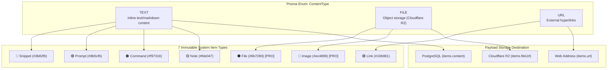
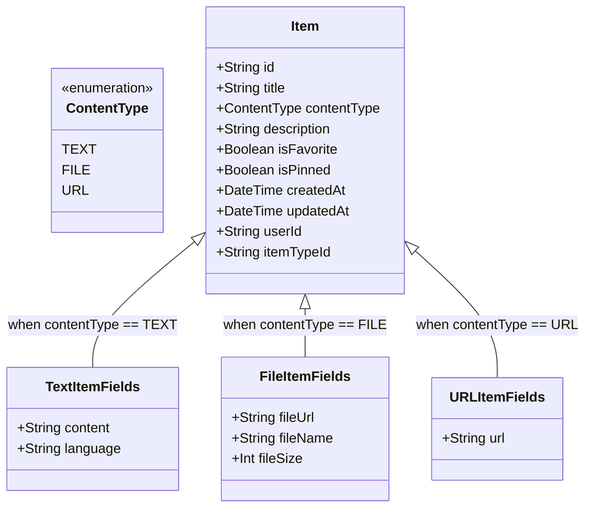
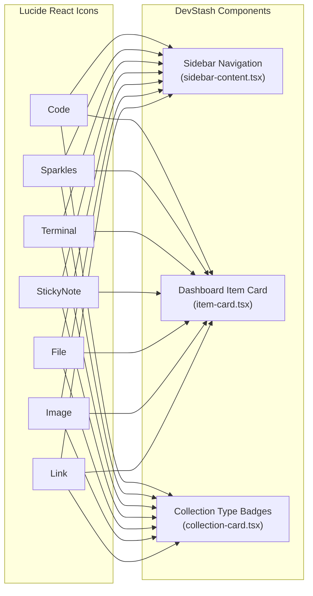

# Item Types & Content Taxonomy Specification

> **DevStash Technical Architecture Document**  
> Comprehensive reference for DevStash item types, content taxonomy, schema definitions, UI representation, and display characteristics.

---

## 📑 Table of Contents

- [1. Executive Summary](#1-executive-summary)
- [2. System Architecture & Taxonomy](#2-system-architecture--taxonomy)
- [3. The 7 System Item Types](#3-the-7-system-item-types)
  - [3.1 Snippet](#31-snippet)
  - [3.2 Prompt](#32-prompt)
  - [3.3 Command](#33-command)
  - [3.4 Note](#34-note)
  - [3.5 File](#35-file)
  - [3.6 Image](#36-image)
  - [3.7 Link](#37-link)
- [4. Content Classification: TEXT vs FILE vs URL](#4-content-classification-text-vs-file-vs-url)
- [5. Shared Properties & Data Model](#5-shared-properties--data-model)
  - [5.1 Prisma Schema Specification](#51-prisma-schema-specification)
  - [5.2 Field Usage Matrix](#52-field-usage-matrix)
- [6. UI & Display Characteristics](#6-ui--display-characteristics)
  - [6.1 Visual Tokens & Color Palette](#61-visual-tokens--color-palette)
  - [6.2 Iconography & Component Mapping](#62-iconography--component-mapping)
  - [6.3 Card & List Presentation](#63-card--list-presentation)
- [7. Centralized Constants Specification](#7-centralized-constants-specification)
- [8. Tier Gating (Free vs Pro)](#8-tier-gating-free-vs-pro)
- [9. Architectural Recommendations & Next Steps](#9-architectural-recommendations--next-steps)

---

## 1. Executive Summary

**DevStash** organizes developer knowledge into **Items** — the core unit of stored content. Every item is bound to an **ItemType**, which governs its visual identity (icon, accent color, branding), routing, storage payload, metadata fields, and UI rendering.

DevStash provides **7 immutable System Item Types** seeded into the database upon initialization:

| Type        | Content Classification | Lucide Icon  | Hex Accent | CSS Token         | Access Tier  | Route             |
| :---------- | :--------------------- | :----------- | :--------- | :---------------- | :----------- | :---------------- |
| **Snippet** | `TEXT`                 | `Code`       | `#3b82f6`  | `--color-snippet` | Free & Pro   | `/items/snippets` |
| **Prompt**  | `TEXT`                 | `Sparkles`   | `#8b5cf6`  | `--color-prompt`  | Free & Pro   | `/items/prompts`  |
| **Command** | `TEXT`                 | `Terminal`   | `#f97316`  | `--color-command` | Free & Pro   | `/items/commands` |
| **Note**    | `TEXT`                 | `StickyNote` | `#fde047`  | `--color-note`    | Free & Pro   | `/items/notes`    |
| **File**    | `FILE`                 | `File`       | `#6b7280`  | `--color-file`    | **Pro Only** | `/items/files`    |
| **Image**   | `FILE`                 | `Image`      | `#ec4899`  | `--color-image`   | **Pro Only** | `/items/images`   |
| **Link**    | `URL`                  | `Link`       | `#10b981`  | `--color-link`    | Free & Pro   | `/items/links`    |

---

## 2. System Architecture & Taxonomy

The item type architecture bridges the database layer ([`prisma/schema.prisma`](file:///c:/Rajesh%20Files/Personal%20Project/devstash/prisma/schema.prisma)), the query/data access layer ([`src/lib/db/items.ts`](file:///c:/Rajesh%20Files/Personal%20Project/devstash/src/lib/db/items.ts)), and the presentation components ([`src/components/dashboard/item-card.tsx`](file:///c:/Rajesh%20Files/Personal%20Project/devstash/src/components/dashboard/item-card.tsx), [`src/components/dashboard/sidebar-content.tsx`](file:///c:/Rajesh%20Files/Personal%20Project/devstash/src/components/dashboard/sidebar-content.tsx)).



---

## 3. The 7 System Item Types

### 3.1 Snippet

- **System Name**: `snippet`
- **Plural / Display Title**: `Snippets`
- **Icon**: `Code` ([`lucide-react`](https://lucide.dev/icons/code))
- **Hex Color**: `#3b82f6` (Blue-500)
- **Content Classification**: `ContentType.TEXT`
- **Target Route**: `/items/snippets`
- **Access Tier**: Free & Pro
- **Purpose**: Stores reusable code blocks, functions, components, configuration snippets, and algorithms across various programming languages.
- **Key Fields Used**:
  - `title`: Name or signature of the snippet (e.g., `useDebounce Hook`).
  - `content`: The raw code body stored as UTF-8 text.
  - `language`: Programming language identifier for syntax highlighting (e.g., `typescript`, `python`, `rust`, `go`, `dockerfile`).
  - `tags`: Category tags (e.g., `react`, `hooks`, `performance`).
  - `description`: Summary of what the snippet accomplishes and parameters accepted.
- **UI & Interaction**:
  - Syntax-highlighted code block with line numbering.
  - Language indicator badge in the card metadata.
  - One-click **Copy Code** button in both list and card views.

---

### 3.2 Prompt

- **System Name**: `prompt`
- **Plural / Display Title**: `Prompts`
- **Icon**: `Sparkles` ([`lucide-react`](https://lucide.dev/icons/sparkles))
- **Hex Color**: `#8b5cf6` (Purple-500)
- **Content Classification**: `ContentType.TEXT`
- **Target Route**: `/items/prompts`
- **Access Tier**: Free & Pro _(AI features like Prompt Optimizer require Pro)_
- **Purpose**: Curates AI system prompts, role instructions, prompt engineering templates, chain-of-thought scaffolds, and few-shot examples.
- **Key Fields Used**:
  - `title`: Name of the prompt persona or task (e.g., `Senior Code Review & Security Audit`).
  - `content`: System prompt text, template variables (e.g. `{{code_diff}}`), or markdown instructions.
  - `language`: Set to `"markdown"` or left `null`.
  - `tags`: Workflow tags (e.g., `ai`, `prompts`, `code-review`, `refactoring`).
  - `description`: Instructions on when and how to deploy the prompt with LLMs.
- **UI & Interaction**:
  - Markdown rendered preview with support for template variable highlighting.
  - One-click **Copy Prompt** button for instant clipboard injection into AI chats.
  - Direct action integration with the Pro **AI Prompt Optimizer** tool.

---

### 3.3 Command

- **System Name**: `command`
- **Plural / Display Title**: `Commands`
- **Icon**: `Terminal` ([`lucide-react`](https://lucide.dev/icons/terminal))
- **Hex Color**: `#f97316` (Orange-500)
- **Content Classification**: `ContentType.TEXT`
- **Target Route**: `/items/commands`
- **Access Tier**: Free & Pro
- **Purpose**: Catalogs CLI commands, terminal one-liners, shell recipes, Docker executions, git workflows, and system administration scripts.
- **Key Fields Used**:
  - `title`: Purpose of the command (e.g., `Undo Last Git Commit (Keep Changes)`).
  - `content`: Exact command line string or multi-line shell script.
  - `language`: Shell environment (`bash`, `zsh`, `sh`, `powershell`, `cmd`).
  - `tags`: CLI tool tags (e.g., `terminal`, `git`, `docker`, `npm`).
  - `description`: Explanation of flags, parameters, and side-effects.
- **UI & Interaction**:
  - Terminal-style monospace container with shell prompt styling (`$` or `>`).
  - One-click **Copy Command** action button for pasting directly into terminal.
  - Shell dialect badge indicator.

---

### 3.4 Note

- **System Name**: `note`
- **Plural / Display Title**: `Notes`
- **Icon**: `StickyNote` ([`lucide-react`](https://lucide.dev/icons/sticky-note))
- **Hex Color**: `#fde047` (Yellow-300 / Amber-400)
- **Content Classification**: `ContentType.TEXT`
- **Target Route**: `/items/notes`
- **Access Tier**: Free & Pro
- **Purpose**: Stores markdown documentation, architecture decision records (ADRs), meeting summaries, checklist templates, and developer scratchpad thoughts.
- **Key Fields Used**:
  - `title`: Subject of the note (e.g., `Database Migration Guidelines & Checklist`).
  - `content`: Multi-line rich Markdown text (tables, checklists, quotes, headers).
  - `language`: Typically `"markdown"` or `null`.
  - `tags`: Topic tags (e.g., `architecture`, `notes`, `planning`).
  - `description`: High-level abstract or topic sentence.
- **UI & Interaction**:
  - Markdown editor / viewer supporting headers, nested task lists, tables, and blockquotes.
  - Note preview cards truncating content gracefully with line clamps.
  - Reading time and word count metadata badges.

---

### 3.5 File

- **System Name**: `file`
- **Plural / Display Title**: `Files`
- **Icon**: `File` ([`lucide-react`](https://lucide.dev/icons/file))
- **Hex Color**: `#6b7280` (Gray-500 / Zinc-500)
- **Content Classification**: `ContentType.FILE`
- **Target Route**: `/items/files`
- **Access Tier**: **Pro Only** _(Badged with `PRO` in the sidebar and navigation)_
- **Purpose**: Manages uploaded configuration files, `.env` templates, Postman collections, PDF reference sheets, ZIP archives, and JSON/YAML data files.
- **Key Fields Used**:
  - `title`: Descriptive file name or purpose.
  - `fileUrl`: Public or pre-signed URL pointing to Cloudflare R2 object storage.
  - `fileName`: Original file name including extension (e.g., `docker-compose.prod.yml`).
  - `fileSize`: File size stored in bytes (converted to KB/MB for display).
  - `tags`: File type/context tags (e.g., `config`, `env`, `postman`).
  - `description`: Purpose of the file attachment and versioning notes.
- **UI & Interaction**:
  - File metadata container with extension badge (e.g., `.JSON`, `.PDF`, `.YML`).
  - Human-readable file size formatter (`formatBytes(item.fileSize)`).
  - Direct download button and text-preview drawer for text/code attachments.

---

### 3.6 Image

- **System Name**: `image`
- **Plural / Display Title**: `Images`
- **Icon**: `Image` ([`lucide-react`](https://lucide.dev/icons/image))
- **Hex Color**: `#ec4899` (Pink-500)
- **Content Classification**: `ContentType.FILE`
- **Target Route**: `/items/images`
- **Access Tier**: **Pro Only** _(Badged with `PRO` in the sidebar and navigation)_
- **Purpose**: Stores UI/UX screenshots, system architecture diagrams, visual assets, wireframes, flowcharts, and design token references.
- **Key Fields Used**:
  - `title`: Image title or screen name.
  - `fileUrl`: CDN URL pointing to the Cloudflare R2 image asset.
  - `fileName`: Original image file name (e.g., `dashboard-drawer-wireframe.png`).
  - `fileSize`: Size in bytes.
  - `tags`: Visual category tags (e.g., `ui`, `wireframe`, `diagram`).
  - `description`: Context describing the visual design or component state.
- **UI & Interaction**:
  - Aspect-ratio locked thumbnail gallery card with image hover zoom.
  - Fullscreen lightbox modal for high-resolution inspection.
  - Image dimensions and file size overlay tags.

---

### 3.7 Link

- **System Name**: `link`
- **Plural / Display Title**: `Links`
- **Icon**: `Link` ([`lucide-react`](https://lucide.dev/icons/link))
- **Hex Color**: `#10b981` (Emerald-500)
- **Content Classification**: `ContentType.URL`
- **Target Route**: `/items/links`
- **Access Tier**: Free & Pro
- **Purpose**: Bookmarks and categorizes technical documentation, API references, GitHub repositories, tools, articles, and design resources.
- **Key Fields Used**:
  - `title`: Link title or resource headline (e.g., `Tailwind CSS v4 Documentation`).
  - `url`: Destination web URL (e.g., `https://tailwindcss.com/docs`).
  - `tags`: Resource tags (e.g., `docs`, `css`, `frontend`).
  - `description`: Brief overview of what the resource contains.
- **UI & Interaction**:
  - Extracted hostname badge (e.g., `tailwindcss.com` or `github.com`).
  - Outbound external link icon (`ExternalLink`) opening in a new tab (`rel="noopener noreferrer"`).
  - One-click **Copy URL** button.
  - OpenGraph rich metadata preview (title, description, favicon).

---

## 4. Content Classification: TEXT vs FILE vs URL

DevStash models item data using a tri-modal storage strategy determined by the `ContentType` database enum:



### Classification Comparison Matrix

| Attribute                 | `ContentType.TEXT`                     | `ContentType.FILE`                   | `ContentType.URL`            |
| :------------------------ | :------------------------------------- | :----------------------------------- | :--------------------------- |
| **Applicable Types**      | `snippet`, `prompt`, `command`, `note` | `file`, `image`                      | `link`                       |
| **Primary Payload Field** | `content` (`TEXT` in PostgreSQL)       | `fileUrl` (`VARCHAR` pointing to R2) | `url` (`VARCHAR` web link)   |
| **Auxiliary Fields**      | `language`                             | `fileName`, `fileSize`               | _None_                       |
| **Storage Engine**        | Neon PostgreSQL database row           | Cloudflare R2 Object Storage         | Neon PostgreSQL database row |
| **Storage Cost Factor**   | Minimal (database disk)                | Storage GB + bandwidth               | Minimal (database disk)      |
| **Copy Action Behavior**  | Copies `content` string                | Copies `fileUrl` or downloads file   | Copies `url` string          |
| **Primary Interaction**   | Read / Edit / Run / Copy               | Download / View / Preview            | Open in new tab (`_blank`)   |
| **Subscription Gate**     | Free & Pro                             | **Pro Only**                         | Free & Pro                   |

---

## 5. Shared Properties & Data Model

### 5.1 Prisma Schema Specification

As defined in [`prisma/schema.prisma`](file:///c:/Rajesh%20Files/Personal%20Project/devstash/prisma/schema.prisma), all 7 item types share a unified table (`items`) with polymorphism handled via `contentType` and the foreign key `itemTypeId`:

```prisma
enum ContentType {
  TEXT
  FILE
  URL
}

model Item {
  id          String      @id @default(cuid())
  title       String
  contentType ContentType
  content     String?     @db.Text // For TEXT types (snippet, prompt, command, note)
  fileUrl     String?              // Cloudflare R2 URL for FILE types (file, image)
  fileName    String?              // Original filename for FILE types
  fileSize    Int?                 // Size in bytes for FILE types
  url         String?              // Destination link for URL types (link)
  description String?     @db.Text
  isFavorite  Boolean     @default(false)
  isPinned    Boolean     @default(false)
  language    String?              // Syntax highlighting (typescript, bash, markdown, etc.)
  createdAt   DateTime    @default(now())
  updatedAt   DateTime    @updatedAt

  // Relationships
  userId      String
  user        User             @relation(fields: [userId], references: [id], onDelete: Cascade)
  itemTypeId  String
  itemType    ItemType         @relation(fields: [itemTypeId], references: [id])
  tags        Tag[]            @relation("ItemTags")
  collections ItemCollection[]

  @@index([userId])
  @@index([itemTypeId])
  @@index([createdAt])
  @@index([userId, isPinned, createdAt(sort: Desc)])
  @@index([userId, isFavorite])
  @@map("items")
}

model ItemType {
  id                    String       @id @default(cuid())
  name                  String
  icon                  String
  color                 String
  isSystem              Boolean      @default(false)

  // User association (null for immutable system types)
  userId                String?
  user                  User?        @relation(fields: [userId], references: [id], onDelete: Cascade)
  items                 Item[]
  defaultForCollections Collection[]

  @@unique([name, userId])
  @@map("item_types")
}
```

### 5.2 Field Usage Matrix

The following matrix documents which database columns are required, optional, or unused for each of the 7 item types:

| Field Name    | Data Type          |  Snippet  |  Prompt   |  Command  |   Note    |   File    |   Image   |   Link    |
| :------------ | :----------------- | :-------: | :-------: | :-------: | :-------: | :-------: | :-------: | :-------: |
| `id`          | `String (cuid)`    |  ✅ Req   |  ✅ Req   |  ✅ Req   |  ✅ Req   |  ✅ Req   |  ✅ Req   |  ✅ Req   |
| `title`       | `String`           |  ✅ Req   |  ✅ Req   |  ✅ Req   |  ✅ Req   |  ✅ Req   |  ✅ Req   |  ✅ Req   |
| `contentType` | `ContentType`      |  `TEXT`   |  `TEXT`   |  `TEXT`   |  `TEXT`   |  `FILE`   |  `FILE`   |   `URL`   |
| `content`     | `String (Text)`    |  ✅ Req   |  ✅ Req   |  ✅ Req   |  ✅ Req   | ❌ _Null_ | ❌ _Null_ | ❌ _Null_ |
| `language`    | `String?`          |  ✅ Opt   |  ✅ Opt   |  ✅ Opt   |  ✅ Opt   | ❌ _Null_ | ❌ _Null_ | ❌ _Null_ |
| `fileUrl`     | `String?`          | ❌ _Null_ | ❌ _Null_ | ❌ _Null_ | ❌ _Null_ |  ✅ Req   |  ✅ Req   | ❌ _Null_ |
| `fileName`    | `String?`          | ❌ _Null_ | ❌ _Null_ | ❌ _Null_ | ❌ _Null_ |  ✅ Req   |  ✅ Req   | ❌ _Null_ |
| `fileSize`    | `Int?`             | ❌ _Null_ | ❌ _Null_ | ❌ _Null_ | ❌ _Null_ |  ✅ Req   |  ✅ Req   | ❌ _Null_ |
| `url`         | `String?`          | ❌ _Null_ | ❌ _Null_ | ❌ _Null_ | ❌ _Null_ | ❌ _Null_ | ❌ _Null_ |  ✅ Req   |
| `description` | `String?`          |  🟡 Opt   |  🟡 Opt   |  🟡 Opt   |  🟡 Opt   |  🟡 Opt   |  🟡 Opt   |  🟡 Opt   |
| `isFavorite`  | `Boolean`          |  🟡 Opt   |  🟡 Opt   |  🟡 Opt   |  🟡 Opt   |  🟡 Opt   |  🟡 Opt   |  🟡 Opt   |
| `isPinned`    | `Boolean`          |  🟡 Opt   |  🟡 Opt   |  🟡 Opt   |  🟡 Opt   |  🟡 Opt   |  🟡 Opt   |  🟡 Opt   |
| `tags`        | `Tag[]`            |  🟡 Opt   |  🟡 Opt   |  🟡 Opt   |  🟡 Opt   |  🟡 Opt   |  🟡 Opt   |  🟡 Opt   |
| `collections` | `ItemCollection[]` |  🟡 Opt   |  🟡 Opt   |  🟡 Opt   |  🟡 Opt   |  🟡 Opt   |  🟡 Opt   |  🟡 Opt   |

---

## 6. UI & Display Characteristics

### 6.1 Visual Tokens & Color Palette

As declared in [`src/app/globals.css`](file:///c:/Rajesh%20Files/Personal%20Project/devstash/src/app/globals.css), each item type has a dedicated CSS variable token registered into the Tailwind CSS v4 `@theme`:

```css
/* src/app/globals.css */
@theme inline {
  --color-snippet: var(--color-snippet);
  --color-prompt: var(--color-prompt);
  --color-command: var(--color-command);
  --color-note: var(--color-note);
  --color-file: var(--color-file);
  --color-image: var(--color-image);
  --color-link: var(--color-link);
}

:root {
  --color-snippet: #3b82f6; /* Blue 500 */
  --color-prompt: #8b5cf6; /* Purple 500 */
  --color-command: #f97316; /* Orange 500 */
  --color-note: #fde047; /* Yellow 300 / Amber 400 */
  --color-file: #6b7280; /* Gray 500 */
  --color-image: #ec4899; /* Pink 500 */
  --color-link: #10b981; /* Emerald 500 */
}
```

### 6.2 Iconography & Component Mapping

All item type icons originate from the standard [`lucide-react`](https://lucide.dev) library:



### 6.3 Card & List Presentation

In [`src/components/dashboard/item-card.tsx`](file:///c:/Rajesh%20Files/Personal%20Project/devstash/src/components/dashboard/item-card.tsx), item cards dynamically adapt their controls and badges based on the item type and content classification:

```tsx
// Excerpt from src/components/dashboard/item-card.tsx
<div
  className="flex h-10 w-10 shrink-0 items-center justify-center rounded-lg border border-border/80 bg-muted/40"
  style={{ color: itemType.color }}
>
  <Icon className="h-5 w-5" />
</div>
```

1. **Left Accent Container**: 40x40px rounded icon container rendered with `itemType.color`.
2. **Metadata Badges**:
   - For `snippet` / `command`: Displays syntax language pill (e.g. `typescript`, `bash`).
   - For `file` / `image`: Displays formatted file size (e.g. `245 KB`, `1.2 MB`).
   - For `link`: Displays extracted web domain (e.g. `nextjs.org`).
3. **Quick Action**:
   - For `TEXT` & `URL` types: Displays a quick copy button (`Copy` / `Check` feedback state).
   - For `link`: Offers an external link icon opening the destination URL.

---

## 7. Centralized Constants Specification

To prevent code duplication and ensure single-source-of-truth consistency across the application, create a centralized constant module at `src/lib/constants/item-types.ts`:

```typescript
// src/lib/constants/item-types.ts

import {
  Code,
  Sparkles,
  Terminal,
  StickyNote,
  File,
  Image,
  Link,
  type LucideIcon,
} from "lucide-react";
import { ContentType } from "@/generated/prisma/enums";

export type SystemItemTypeName =
  | "snippet"
  | "prompt"
  | "command"
  | "note"
  | "file"
  | "image"
  | "link";

export interface ItemTypeDefinition {
  name: SystemItemTypeName;
  label: string;
  pluralLabel: string;
  icon: LucideIcon;
  iconName: string;
  color: string;
  cssVariable: string;
  contentType: ContentType;
  route: string;
  isPro: boolean;
  description: string;
  supportedLanguages?: string[];
}

export const SYSTEM_ITEM_TYPES: Record<SystemItemTypeName, ItemTypeDefinition> =
  {
    snippet: {
      name: "snippet",
      label: "Snippet",
      pluralLabel: "Snippets",
      icon: Code,
      iconName: "Code",
      color: "#3b82f6",
      cssVariable: "--color-snippet",
      contentType: ContentType.TEXT,
      route: "/items/snippets",
      isPro: false,
      description:
        "Code snippets, reusable patterns, and component definitions",
    },
    prompt: {
      name: "prompt",
      label: "Prompt",
      pluralLabel: "Prompts",
      icon: Sparkles,
      iconName: "Sparkles",
      color: "#8b5cf6",
      cssVariable: "--color-prompt",
      contentType: ContentType.TEXT,
      route: "/items/prompts",
      isPro: false,
      description: "AI prompts, templates, and persona instructions",
    },
    command: {
      name: "command",
      label: "Command",
      pluralLabel: "Commands",
      icon: Terminal,
      iconName: "Terminal",
      color: "#f97316",
      cssVariable: "--color-command",
      contentType: ContentType.TEXT,
      route: "/items/commands",
      isPro: false,
      description: "CLI commands, terminal one-liners, and shell recipes",
    },
    note: {
      name: "note",
      label: "Note",
      pluralLabel: "Notes",
      icon: StickyNote,
      iconName: "StickyNote",
      color: "#fde047",
      cssVariable: "--color-note",
      contentType: ContentType.TEXT,
      route: "/items/notes",
      isPro: false,
      description: "Markdown notes, documentation, checklists, and scratchpads",
    },
    file: {
      name: "file",
      label: "File",
      pluralLabel: "Files",
      icon: File,
      iconName: "File",
      color: "#6b7280",
      cssVariable: "--color-file",
      contentType: ContentType.FILE,
      route: "/items/files",
      isPro: true,
      description:
        "Configuration files, environment templates, and binary documents",
    },
    image: {
      name: "image",
      label: "Image",
      pluralLabel: "Images",
      icon: Image,
      iconName: "Image",
      color: "#ec4899",
      cssVariable: "--color-image",
      contentType: ContentType.FILE,
      route: "/items/images",
      isPro: true,
      description:
        "Screenshots, UI mockups, architecture diagrams, and design assets",
    },
    link: {
      name: "link",
      label: "Link",
      pluralLabel: "Links",
      icon: Link,
      iconName: "Link",
      color: "#10b981",
      cssVariable: "--color-link",
      contentType: ContentType.URL,
      route: "/items/links",
      isPro: false,
      description: "Web bookmarks, documentation links, and API references",
    },
  };

export const ITEM_TYPE_NAMES = Object.keys(
  SYSTEM_ITEM_TYPES,
) as SystemItemTypeName[];
```

---

## 8. Tier Gating (Free vs Pro)

The subscription tier impacts access to specific item types and features:

```mermaid
flowchart TD
    User["User Session"] --> TierCheck{"User Plan"}
    TierCheck -->|Free Tier| FreeFeatures["Free Tier<br/>• Up to 50 Items Total<br/>• Up to 3 Collections<br/>• Snippet, Prompt, Command, Note, Link<br/>• Basic Search"]
    TierCheck -->|Pro Tier ($8/mo)| ProFeatures["Pro Tier<br/>• Unlimited Items & Collections<br/>• File & Image Uploads (R2)<br/>• AI Auto-Tagging & Summaries<br/>• AI Prompt Optimizer<br/>• Data Export (JSON/ZIP)"]

    FreeFeatures -.->|Gated| GatedTypes["🚫 Files & Images Gated<br/>(Badge displayed in sidebar)"]
```

> [!NOTE]
> **Development Environment Override**: As specified in [`context/project-overview.md`](file:///c:/Rajesh%20Files/Personal%20Project/devstash/context/project-overview.md), during development all users have full feature access. Pro gating enforcement is enabled prior to production release.

---

## 9. Architectural Recommendations & Next Steps

1. **Centralize Type Constants**:
   - Consolidate all icon dictionaries and color lookups from [`src/components/dashboard/item-card.tsx`](file:///c:/Rajesh%20Files/Personal%20Project/devstash/src/components/dashboard/item-card.tsx), [`src/components/dashboard/sidebar-content.tsx`](file:///c:/Rajesh%20Files/Personal%20Project/devstash/src/components/dashboard/sidebar-content.tsx), and [`src/components/dashboard/collection-card.tsx`](file:///c:/Rajesh%20Files/Personal%20Project/devstash/src/components/dashboard/collection-card.tsx) into a single [`src/lib/constants/item-types.ts`](file:///c:/Rajesh%20Files/Personal%20Project/devstash/src/lib/constants/item-types.ts).

2. **Form & Validation Schemas (Zod)**:
   - Implement type-specific Zod validation schemas for item creation:
     - `textItemSchema`: requires `content`, optional `language`.
     - `fileItemSchema`: requires `fileUrl`, `fileName`, `fileSize`.
     - `urlItemSchema`: requires valid `url` (`z.string().url()`).

3. **Cloudflare R2 Integration for File & Image Types**:
   - Set up pre-signed URL generation API routes (`/api/upload/presign`) for uploading `file` and `image` types directly to Cloudflare R2 object storage.

4. **Dynamic Item Detail & Create Drawers**:
   - Ensure the item creation drawer dynamically switches input fields (Monaco/CodeMirror editor vs Markdown textarea vs drag-and-drop file uploader vs URL input) when the user changes the item type selector.
